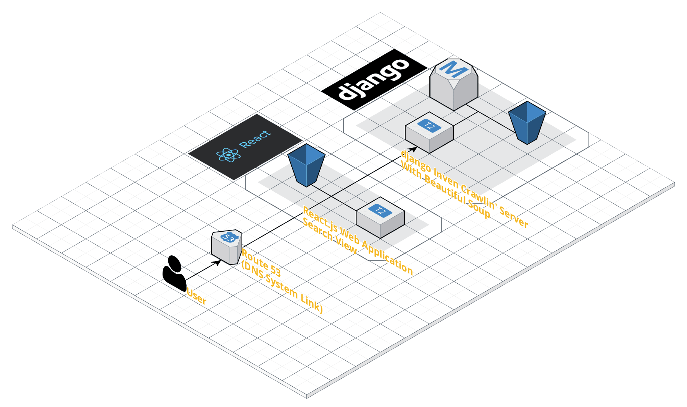

# Love Live(ラブライブ) Inven Crawlin' Project

러브라이브 스쿨 아이돌 프로젝트 게임을 즐기는 유저들이 카드 정보에 대하여 더욱 시각화된 Web 으로 풍부한 정보를 제공 받기 위한 토이 프로젝트입니다.

이전의 검색 기능을 Detail 하게 설정하였으며, 그래프와 숫자 애니메이션 등을 사용하여 Modern Web 에 더욱 가깝게 제작하였습니다.

특히 이번 프로젝트에서는 시각화를 중점으로 하기 때문에 Responsive Ratio 를 맞추는 것을 집중했습니다.

Inven 사이트에서 얻어온 Crawling 데이터를 RESTful API 서버로 구축하여 Web Application 과 Native App 에서 받아오는 프로젝트로 구상하였습니다.

## Issues

- django 를 이용한 간단한 REST API를 구축합니다.

- Beautiful Soup 를 이용해 한 웹 사이트의 HTML 문서를 파싱하여 데이터베이스에 구축합니다.

- django REST Framework 와 Redux 를 연동 시키는 방법에 대해 생각합니다.

## Development Environments

- OS : Windows 10

- Database : SQLite 3

- IDE : Visual Studio Code

- Main Language : Python 3.7, Node.js 9.3.0

## Project Structure

이 토이 프로젝트에서 사용한 대표 Framework, Library 는 다음과 같습니다.

- Server
    - Python 3.7
    - django REST Framework 3.9
    - Beautiful Soup 4
  
- Web
    - JavaScript ES6
    - React.js v16.4
    - Redux, AJAX(Axios)
    - Naver Papago 번역 Link

## Thanks To

- [django REST API 구축 방법](http://jamanbbo.tistory.com/43)

- [Lovelive 인벤](http://lovelive.inven.co.kr/)

## Author

- 강인성([tails5555](https://github.com/tails5555))