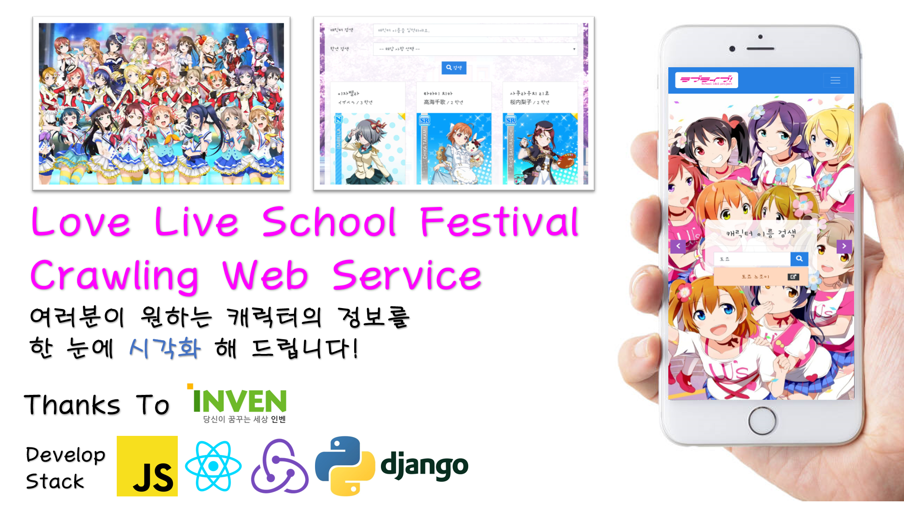
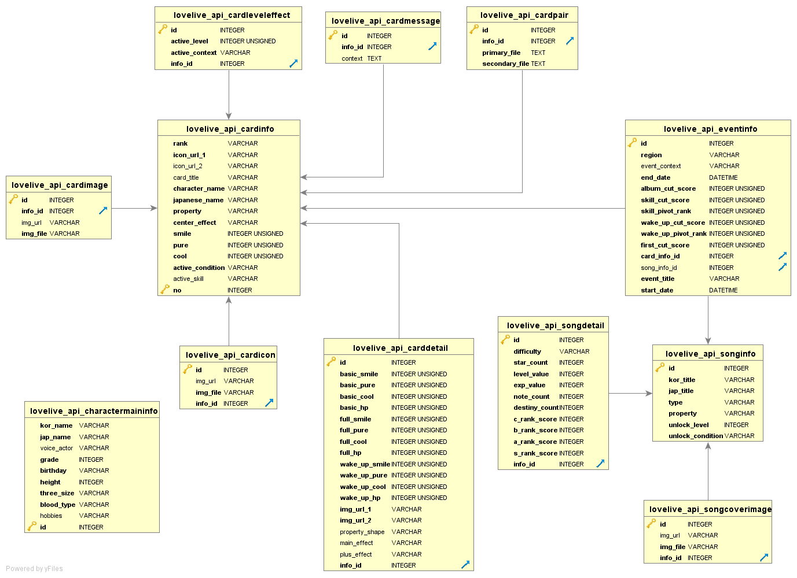

# Love Live(ラブライブ) Inven Crawlin' Project Server<br/><small>With django, Beautiful Soup</small>



## Issues

- django REST API 를 사용하여 Crawling 과정을 거친 데이터들을 JSON 방식으로 가공합니다.

- django 에서 이미지 파일들에 대해서도 데이터베이스에 저장하는 과정을 공부합니다.

- Pagination 과 검색 기능을 향상시키기 위한 방법을 구상합니다.

## Installed Applications

django 에서 추가로 사용한 Application 은 아래와 같습니다.

이는 PIP 를 사용하여 설치하세요.

```python
INSTALLED_APPS = [
    'django.contrib.admin',
    'django.contrib.auth',
    'django.contrib.contenttypes',
    'django.contrib.sessions',
    'django.contrib.messages',
    'django.contrib.staticfiles',
    'rest_framework',
    'lovelive_api.apps.LoveliveApiConfig',
    'django_filters',
    'corsheaders'
]
```

## Relational Database



데이터베이스의 구성은 위의 사진과 같습니다.

## Web Side References

Web Application 은 React.js 를 사용했습니다.

[참고하러 가기](https://github.com/tails5555/lovelive_crawlin_project/tree/master/lovelive_card_web)

## Wiki

RESTful API 에 대한 정보, Web Application 의 캡쳐 정보 등은 아래 페이지에서 열람하실 수 있습니다.

[WIKI 로 이동](https://github.com/tails5555/lovelive_crawlin_project/wiki) 

## Author

- 강인성([tails5555](https://github.com/tails5555))

